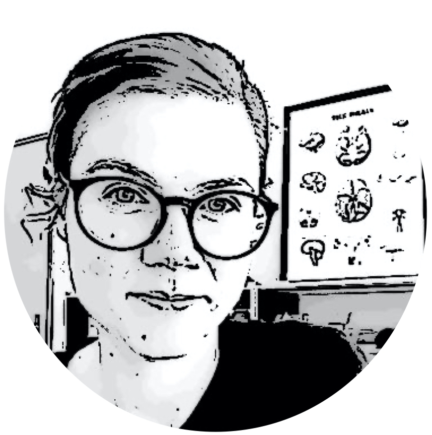

```{r setup, include=FALSE}
knitr::opts_chunk$set(echo = FALSE)

# Learn more about creating websites with Distill at:
# https://rstudio.github.io/distill/website.html

# Learn more about publishing to GitHub Pages at:
# https://rstudio.github.io/distill/publish_website.html#github-pages

```
```{css, echo=FALSE}
h1, h2, h3, h4{
  text-align: center;
}
```

```{r, fig.align="center",fig.height=0.25,fig.width=0.25}

```
<center>
_Image courtesy of [kusoCartoon](https://kusocartoon.com)_
</center>
$~$
<p style="text-align:justify;">
I am a postdoctoral researcher at the Center for Cognitive and Decision Sciences at the University of Basel in Switzerland. As a research psychologist in the area of decision science, I study how and why humans differ in their choices compared to others. I have a special interest in risk- and impulsivity related decisions, which we encounter in both day-to-day contexts but which also play a crucial role in clinical and legal contexts.</p>

